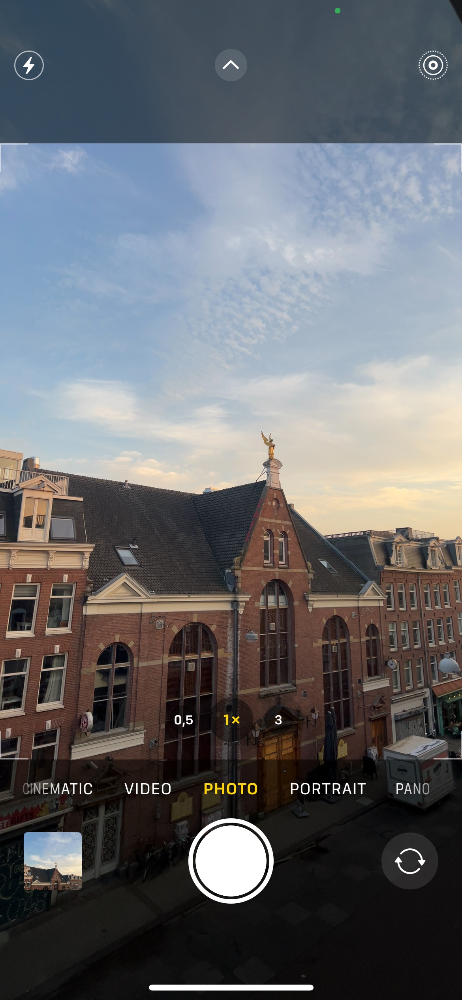

# SwiftUICameraAppSpeedrunChallenge
My submission for the SwiftUISeries' speed run challenge

Speedrun video: https://www.youtube.com/watch?v=N9L8XfZaIv8

Few notes: I obviously practice a bit before, in order to have the right sizes, image names, and overall architecture. I went a little bit further by having an animated capture mode selector (photo, portrait, pano, etc...) as it actually helped me to correctly center the selected mode (photo) with the shutter button. I also reproduced small details like the capsule background behind the zoom buttons, or the 4 visor angles in the viewer.

Target |  Submission
--------|---------
 | 

